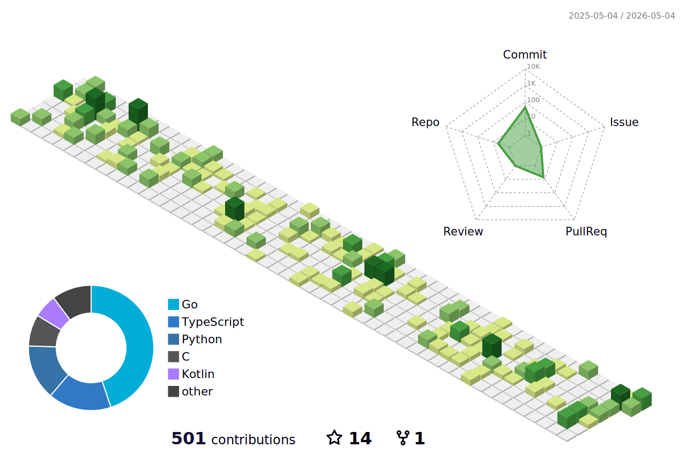

<!--
  Profile README — Diogo Almeida (@diogoX451)
  Clean + modern layout with dark/light aware images.
-->

<h1 align="center">Diogo Almeida</h1>

  <b>Software Engineer</b> · Distributed Systems · AI / RAG / Agents · IoT 
  Go • PHP/Laravel • TypeScript · PostgreSQL · Milvus · Neo4j · NATS

  
  
  
  
  
  

  <b>🇺🇸 English</b> &nbsp;·&nbsp; <a href="README.pt-BR.md">🇧🇷 Português</a>

---

### 👋 About me

Software engineer focused on **backend and distributed systems**, building scalable
services in **Go** and **PHP/Laravel**, with a growing focus on **LLM-powered agents**
and **RAG** pipelines. I like designing systems that are event-driven, observable, and
hot-swappable — and occasionally shipping IoT hardware to prove they work in the real world.

- 🧠 Building **Archon** — a self-evolving Interaction Net engine where LLMs architect computation graphs and agents execute through parallel rewriting. Its Go building blocks are open source in **[archon-oss](https://github.com/diogoX451/archon-oss)**.
- 🌱 Deep-diving **vector search (Milvus)**, **graph databases (Neo4j)** and **event sourcing (NATS JetStream)**.
- 💬 Ask me about Go concurrency, RAG over SQL, or wiring an ESP32 to a real backend.
- 📫 Reach me at **diogosgn@gmail.com**.

---

### 🚀 Featured Projects

| Project | Description | Stack |
| --- | --- | --- |
| **[archon-oss](https://github.com/diogoX451/archon-oss)** | Open-source Go toolkit behind Archon: LLM gateway, need-protocol, event envelopes, token bucket, NATS bus. | `Go` `OSS` |
| **[rag-sql](https://github.com/diogoX451/rag-sql)** | RAG pipeline that understands a database schema to ground LLM responses. | `Go` `RAG` |
| **[GopherORM](https://github.com/diogoX451/GopherORM)** | Lightweight ORM for Go. | `Go` |
| **[DataNumbers-IoT](https://github.com/diogoX451/DataNumbers-IoT)** | IoT project built for a national tech fair. | `TypeScript` `IoT` |

---

### 🧰 Tech Stack

**Languages**  

**Frameworks & Frontend**  

**Data & Infra**  

---

### 📈 3D Contribution Graph

<picture>
  <source media="(prefers-color-scheme: dark)" srcset="./profile-3d-contrib/profile-season-animate.svg" />
  <source media="(prefers-color-scheme: light)" srcset="./profile-3d-contrib/profile-green-animate.svg" />
  
</picture>

